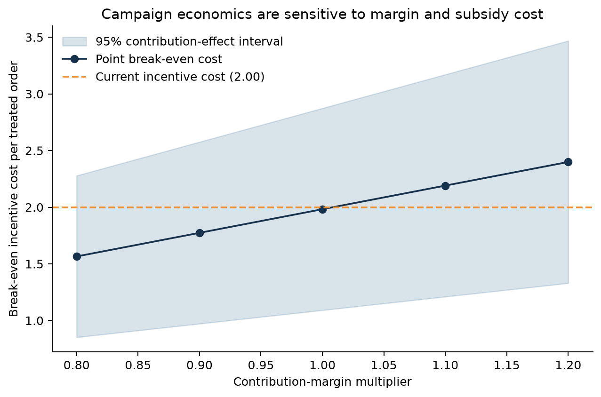
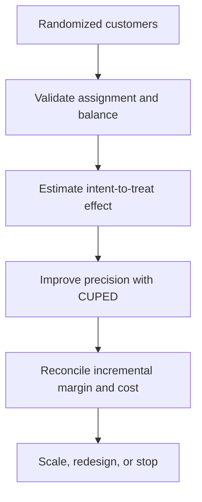
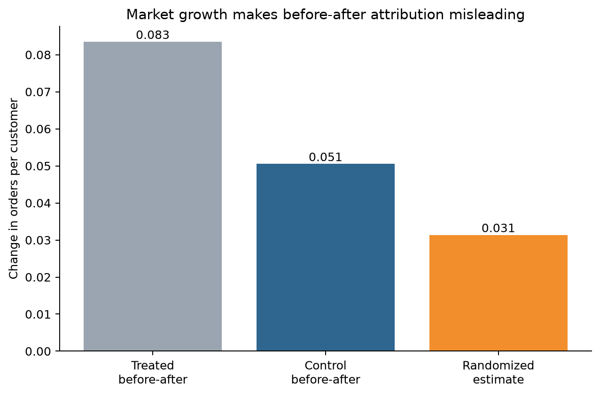
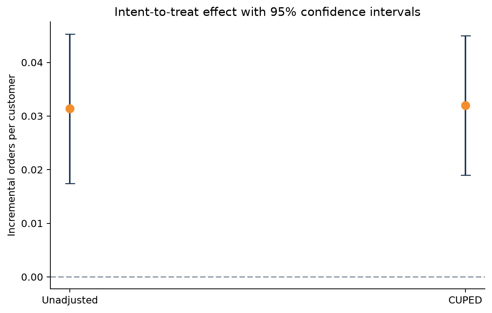
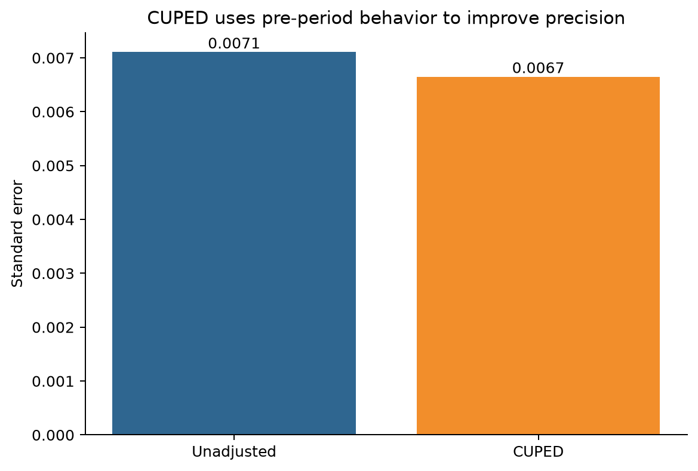
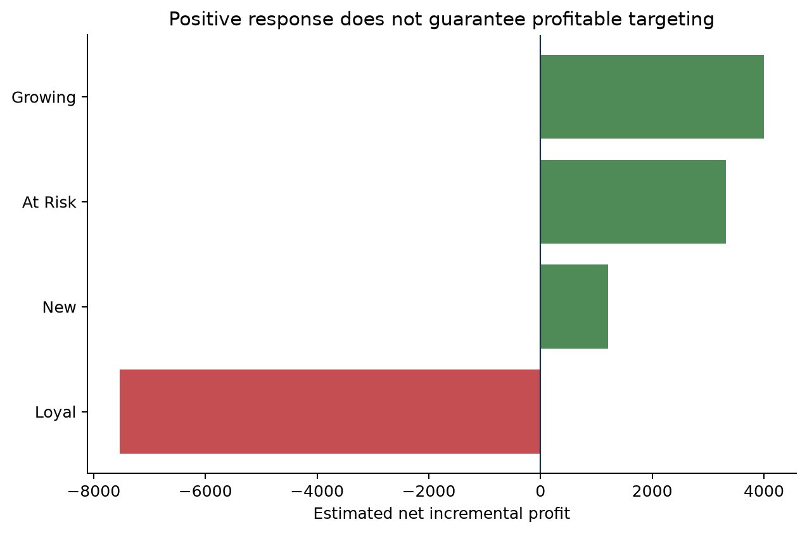
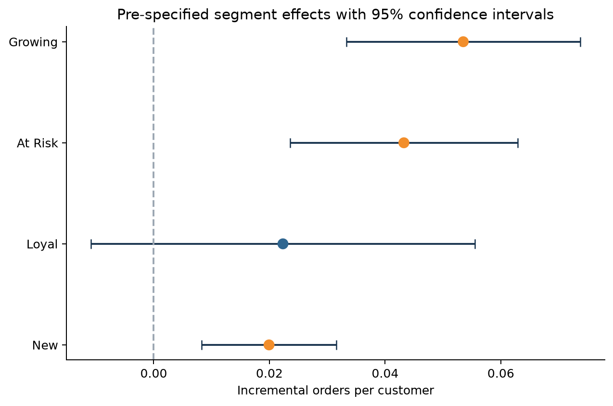
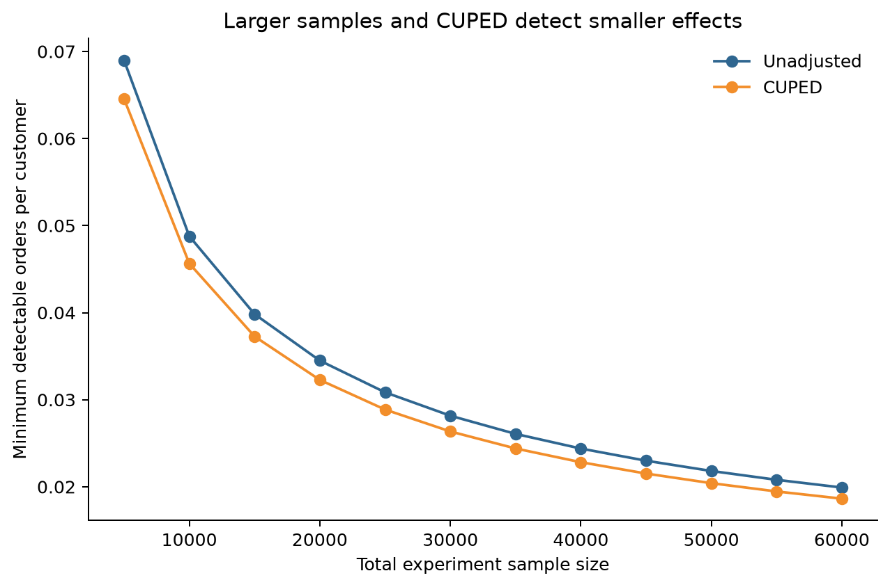

# Marketing Experiment Incrementality

A campaign can increase observed orders and still destroy value. This project uses
a reproducible synthetic randomized experiment to answer two separate questions:

1. Did the campaign cause incremental customer behavior?
2. Did the incremental contribution exceed the full campaign cost?

All customer and campaign data in this repository is generated from scratch.

## Executed economic decision

**Redesign.** The CUPED order effect is positive, but the broad campaign's estimated
net incremental profit is **-259**, with a 95% interval from **-13,226 to 12,709**
synthetic currency units. Because the profit interval includes zero, the fixed
`economic-rule-v1` does not support Scale.

At the base contribution margin, the point break-even incentive cost is **1.98** per
treated order versus the current cost of **2.00**. The contribution-effect interval
maps to a break-even range of **1.09 to 2.87**. Observed campaign costs are treated as
fixed; the margin scenarios are deterministic stress tests, not forecasts.

[Decision note](reports/decision_note.md) ·
[Break-even table](reports/economic_break_even.csv)



## Business decision

A customer offer is tested against a concurrent holdout. The analysis must decide
whether to scale, redesign, or stop the campaign and identify which pre-defined
customer segments deserve a follow-up test.

## Analysis flow



The primary metric is orders per randomized customer over 28 days. Purchase
conversion, revenue, contribution, segment effects, and power are secondary outputs.
The complete rules are fixed in the
[analysis plan](docs/analysis_plan.md) before outcomes are interpreted.

## Why the control group matters

The simulation includes market-wide growth between the pre-period and the campaign
period. A treated-group before-after comparison therefore mixes campaign impact with
the change that all customers experienced.



## Experiment health

The pipeline checks:

- sample ratio mismatch against the planned 50/50 allocation;
- pre-treatment balance using standardized mean differences;
- deterministic data generation and valid outcome ranges.

The latest run details are available in
[the reproducible summary](reports/run_summary.md) and
[the balance table](reports/balance_checks.csv).

### Latest reproducible run

The committed results use 60,000 simulated customers and seed `42`.

| Experiment health measure | Result |
|---|---:|
| Control customers | 30,142 |
| Treatment customers | 29,858 |
| Sample ratio check p-value | 0.246 |
| Largest absolute pre-treatment SMD | 0.012 |

The allocation and all documented balance checks pass their pre-defined thresholds.

## Incremental effect and CUPED

Both the unadjusted randomized estimate and CUPED are reported with 95% confidence
intervals. CUPED uses pre-period orders to reduce predictable customer-level
variation; it does not replace randomization.

| Order outcome | Result |
|---|---:|
| Control mean | 0.456 per customer |
| CUPED incremental effect | **0.032 per treated customer** |
| Relative lift | **7.0%** |
| 95% confidence interval | 0.019 to 0.045 |
| CUPED variance reduction | 12.4% |





## From lift to profit

Campaign economics are calculated as:

```text
Incremental contribution = CUPED contribution effect × treated customers
Campaign cost = contact cost + incentive cost on treatment-group orders
Net incremental profit = incremental contribution - campaign cost
```

Charging campaign cost to all treated activity exposes subsidy leakage: some
incentives are paid to customers who would have purchased without treatment.

| Portfolio estimate | Synthetic currency units |
|---|---:|
| Incremental orders | 955 |
| Incremental contribution before campaign cost | 30,328 |
| Campaign cost | 30,587 |
| Net incremental profit | **-259** |
| 95% net-profit interval | **-13,226 to 12,709** |
| Incremental ROI | **-0.8%** |

The order effect is statistically positive, but the portfolio profit point estimate
is slightly negative and its confidence interval crosses zero. The fixed decision is
**Redesign**: remove the low-response, high-subsidy audience and confirm the revised
targeting rule in a new experiment.

The curve varies contribution margin from 0.8x to 1.2x and reports the incentive
cost per treated order that would make point net profit equal zero. Its band carries
the CUPED contribution-effect interval through the same calculation; it does not
assign probabilities to the margin scenarios.



The auditable results are in
[campaign economics](reports/campaign_economics.csv) and the short
[decision note](reports/decision_note.md). The rule and its revision history are in
the [analysis plan](docs/analysis_plan.md).

## Pre-specified segment analysis

New, Growing, Loyal, and At Risk customers have separate CUPED estimates. Holm
adjustment controls for the four comparisons. Segment findings are treated as inputs
to the next experiment, not as permanent targeting rules.



## Power and minimum detectable effect

The project calculates the effect size detectable at 5% significance and 80% power
for different sample sizes, before and after CUPED variance reduction.



## Repository structure

```text
.
├── src/marketing_incrementality/  # simulation, diagnostics, estimation, economics
├── tests/                         # statistical, financial, and end-to-end tests
├── docs/                          # analysis plan, metrics, and interview guide
├── reports/                       # reproducible aggregate outputs and figures
└── .github/workflows/ci.yml
```

## Reproduce the project

Python 3.11 or later is required.

```bash
python -m venv .venv
source .venv/bin/activate
python -m pip install -e ".[dev]"
python -m marketing_incrementality.cli run
python -m ruff check .
python -m pytest
python scripts/check_sensitive.py
```

The customer-level synthetic dataset is written to an ignored directory. Only
compact aggregate outputs are committed.

## Limitations

- Synthetic results verify the workflow but do not predict real campaign lift.
- The simulation assumes clean randomization, complete outcomes, and no interference
  between customers.
- CUPED cannot repair sample ratio mismatch, missing data, or treatment contamination.
- Segment effects require confirmation in a new pre-registered experiment.
- Production use needs governed exposure logs, delayed-outcome rules, cost
  reconciliation, and monitoring for novelty and spillover effects.

See [data provenance](DATA_PROVENANCE.md), the
[metric dictionary](docs/metric_dictionary.md), and the
[interview guide](docs/interview_guide.md).
